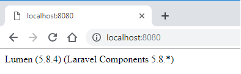

# Laboration 5: Lumen med Controllers, ORM

Denna laboration innebär två delar.

1. Ett första Lumen-projekt, med fokus på routes & JSON-formaterad data
2. Ett Lumen-projekt, med fokus på controllers, modeller/ORM, databas

# Del 1 - Routes & JSON

I denna laboration ska vi använda ramverket [Lumen](http://lumen.laravel.com) för att bygga ett webb-API. Vårt API ska vara väldigt enkelt och hantera en samling av produkter. Vårt API ska slutligen kunna erbjuda att:
- Lista alla produkter
- Lista en vald produkt (genom id)
- Skapa en ny produkt
- Uppdatera en produkt
- Radera en produkt

Under labben kommer vi att jobba med olika delar av lumen. [Lumens dokumentation](https://lumen.laravel.com/docs/) är mycket bra att ha nära till hands då.

## 1. Skissa upp ert API
Frågor som ni ska besvara innan ni börjar bygga er webbtjäst är:
- Vilken/vilka resurser ska vi erbjuda?
- Vilka URI ska vi använda & vilka HTTP-metoder är kopplade till dessa?

Skissa upp detta, så att ni vet hur ert API ska utformas.

*Visa detta för labbhandledaren för att stämma av att det ser bra ut*

## 2. Installera Lumen
Eftersom att vi ska jobba i Lumen så är det viktigt att ni skapar ett `Lumen`-projekt att arbeta i. Vill vi använda Lumens egna installator så behöver vi först installera denna. Detta gör ni genom:

```bash
composer global require "laravel/lumen-installer"
```

Nu är vi redo att följa [installationsguiden](https://lumen.laravel.com/docs/) på lumens webbplats. Navigera till önskad plats där vi vill att projektet ska ligga och kör:

```bash
lumen new lab5
```

*lab5* ovan är namnet på projektet som skapas.

Testa att allt fungerar genom att i terminalen navigera till projektet och starta en PHP-server genom:
```bash
php -S localhost:8000 -t public
```
Surfa sedan till adressen [http://localhost:8000/](http://localhost:8000/) för att se att det fungerar som det ska! Det borde se ut något i stil med detta:



## 3. En ny webbtjänst blir till!

### 3.1. Routes
Börja med att skapa de routes (som ni kom fram till i del 1. av labben), se [lumens dokumentation](https://lumen.laravel.com/docs/5.8/routing) om ni behöver fräscha upp minnet hur man gör detta. Ni bör alltså skapa routes för att `skapa`, `lista`, `visa`, `uppdatera` & `radera` produkter. Dubbelkolla att routes fungerar genom exempelutskrifter, t.ex.

```php
$router->get('/products', function () {
    return 'Soon, we will list the products here!';
});
```

*OBS*. För att testa andra anrop än `GET`-anrop till er webbtjänst rekommenderar vi att ni använder [Postman](https://www.getpostman.com/).

### 3.2. Datakälla - produkter
Skapa en datakälla med produkter (i t.ex. `json`), eller använd denna exempelfil nedan:
```json
{
    "products": [
        {
            "id": 1,
            "title": "SAMSUNG G950 Galaxy S8",
            "price": 7990
        },
        {
            "id": 2,
            "title": "APPLE iPhone 7 32 GB",
            "price": 6989
        },
        {
            "id": 3,
            "title": "ASUS ZenFone 3 Max 32 GB",
            "price": 2990
        },
        {
            "id": 4,
            "title": "HUAWEI P8 Lite",
            "price": 1490
        }
    ]
}
```

Spara denna fil som `products.json` i mappen `resources`, så kan vi nå den genom följande exempelkod i `web.php`:
```php
$router->get('/', function () {
    // Convert our products from json to object i PHP
	$products = json_decode(file_get_contents("../resources/products.json"));

    // Return all products in JSON-format
	return response()->json($products);
});
```

### 3.3. Fortsätt att bygga ut ert API
I denna del av laborationen ska ni bygga funktioner för att:
- Visa en specifik produkt
- Lägga till en produkt

Ytterliggare funktioner för ert API lämnar vi till den andra delen av laborationen.

## 4. Klar?
När denna del av laborationen klar, visa & reflektera gärna tillsammans med labbhandledaren.

# Del 2 - Controllers / Models / Databas, m.m.

I denna labb ska vi fortsätta att lära oss om de olika komponenterna i Lumen, för att effektivisera och förbättra hur vi utvecklar webbapplikationer. Vi kommer att fokusera på:
- Controllers
- Databas
    - Migrations
    - Seeds
- Models med ORM

Detta innebär att ni behöver ha gjort den första delen av laborationen, då vi kommer att bygga vidare på denna.

## 1. Förbättra vårt produkt-API
Vi ska förbättra vårt produkt-API och istället för att bygga en lösning när vi sparar produkterna i `json`-format, spara dessa i en databas. Vi ska dessutom använda `migrations` för versionshantering av databasen och `seeds` för att populera databasen. Detta för att underlätta utvecklingen av API:t.

### 2.1. Resurser
Vi ska i denna labb hantera tre resurser, med följande egenskaper:
1. Produkt
    - id
    - titel
    - pris
    - skapad
    - uppdaterad
2. Butik
    - id
    - namn
    - stad
    - skapad
    - uppdaterad
3. Recension
    - id
    - betyg
    - kommentar
    - skapad
    - uppdaterad

De ska ha följande relationer:
- En produkt kan tillhöra flera butiker
- En butik kan ha flera produkter
- En produkt kan ha flera recensioner
- En recension kan bara tillhöra en produkt

Inspireras gärna av [tillhörande föreläsning](/Lectures/8/lecture.md) och föreläsningens exempel som ni kan hitta [här på GitHub](https://github.com/Tibbelit/da288a-vt19-lumen).

#### 2.1.1 Rita ett ER-diagram
Utifrån beskrivningen ovan, skapa ett ER-diagram. Diskutera gärna ER-diagrammet med era kursare och handledare för att få detta korrekt innan ni går vidare.

#### 2.1.2. Skapa migrations
Nu är dags för er att skapa tabellerna i databasen genom `migrations`. Känner ni er inte bekväma mer `migrations` så läs den [officiella dokumentation](https://laravel.com/docs/5.8/migrations), titta på hur vi skapade våra migrations i [senaste föreläsningen](/Lectures/8/lecture.md) och titta på de `schema` vi skapade för våra `migrations` på föreläsningen [genom GitHub](https://github.com/Tibbelit/da288a-vt19-lumen).

Skapa följande tabeller (tänk på att följa namngivningskonventaioner för laravel/lumen: singular och gemener):
- products
    - id (int, auto_increment, primary key)
    - title (varchar)
    - price (float)
- stores
    - id (int, auto_increment, primary key)
    - name (varchar)
    - city (varchar)
- reviews
    - id (int, auto_increment, primary key)
    - product_id (int)
    - rating (int)
    - comment (text)
- product_store
    - id (int, auto_increment, primary key)
    - product_id
    - store_id

Alla tabeller ska sedan ha kolumnerna `created_at` och `updated_at` som ni kan skapa genom följande kod i alla tabellerna:
```php
$table->timestamps();
```

När ni skapat och definierat `migrations` för tabellerna ovan så kör
```bash
php artisan migrate
```
för att verkställa era `migrations` och skapa tabellerna.

#### 2.1.3. Skapa seeding
En databas utan data är inte speciellt roligt! Det är därför dags för er att skapa lite data som vi kan arbeta med i labben. Skapa följande:
- Minst tre produkter
- Minst tre butiker
- Skapa kopplingar mellan produkter och butiker (många till många-relation)
- Skapa minst tre recensioner som ni kopplar till valfria produkter.

Känner ni er inte bekväma mer `seeding` så läs den [officiella dokumentation](https://laravel.com/docs/5.8/seeding), titta på hur vi skapade våra seeds i [senaste föreläsningen](/Lectures/8/lecture.md) och titta på de `inserts` vi skapade för våra `seeding` på föreläsningen [genom GitHub](https://github.com/Tibbelit/da288a-vt19-lumen).

När ni skapat och definierat `seeds` för tabellerna ovan så kör
```bash
php artisan db:seed
```
för att verkställa era `seeds` och populera tabellerna.


### 2.2. Uppdatera/bygg era routes & controllers
Nu när vi har en databas som kan förse vår applikation med data (produkter/butiker/recensioner) så ska vi strukturera upp vår applikation. Gör routes för att:
1. Hämta alla produkter
2. Hämta detaljerad information om en produkt

De routes som ni skapar ska skicka vidare anropet till en controller vid namn `ProductsController`. I er `ProductsController` skapa följande funktioner:
1. `index`
    - listar alla produkter
2. `show`
    - visar detaljerd information om en produkt.
        - Basinformation om produkten
        - Vilka butiker den finns i
        - Recensioner kring produkten

Behöver ni inspiration för hur detta ska göras, så titta i den [officiella dokumentation](https://laravel.com/docs/5.8/seeding), samt i det exempel som vi [gjorde på föreläsningen](https://github.com/Tibbelit/da288a-vt19-lumen). Ni ska göra i princip samma sak som vi gjorde med filmerna.

#### Viktigt!
För att kunna använda ORM så avkommentera följande rader i filen `bootstrap/app.php`:
```php
$app->withFacades();
$app->withEloquent();
```

## 3. Vidareutveckling av er webbtjänst
Nu har ni byggt en bra grund för er webbtjänst! Men det finns mycket kvar att göra! Beroende på hur mycket tid ni har, så är här några punkter som borde vidareutvecklas:
- Visa upp butiker / butik med produkter
- Visa upp recensioner / recension med produkt
- CRUD (create, read, update, delete) för alla våra resurser.

Har ni frågor på dessa punkterna så fråga gärna labbhandledaren!