# Laboration 8: Integration och Azuredeployment

I denna labb ska vi sätta upp en miljö för Continuous Integration & Delivery. Vi kommer att utgå från [Insultr](https://github.com/koddas/insultr), en version av koden som vi arbetade med i lab 7.

## Upplägg på labben

1. Hämta koden och lägg till tester
2. Förbered Azure.
3. Pusha förra veckans labbuppgift till GitHub.
3. Förbered Azure Pipelines.
4. Konfigurera projektet.
5. Kontrollera att allt fungerar.

## 1. Hämta koden och lägg till tester

Börja med att gå in på [Insultr](https://github.com/koddas/insultr) och gör en fork av projektet genom att klicka på knappen *Fork*.


Du får nu en egen kopia av projektet som du kan skriva till och arbeta med hur du vill. I ditt nya projekt har du en del nyttigheter:

* *src/* - katalogen där själva applikationen bor.
* *src/.htaccess* - en konfigrationsfil för webbservern.
* *tests/* - några (dvs ett enda) enhetstester för att säkerställa funktionaliteten.
* *composer.json* - alla de beroenden som applikationen behöver.
* *composer.lock* - den där filen som du inte ska röra.
* *Dockerfile* - ett recept som beskriver hur den slutgiltiga applikationen ska köras.
* *LICENSE* - en textfil som beskriver vad du får och inte får göra med min vackra kod.
* *phpunit.xml* - en konfigurationsfil för testerna. Den beskriver bara var testerna finns.
* *README.md* - en readme-fil som innehåller information om applikationen.
* *.gitignore* - filen som berättar vad Git ska låta bli att röra.

### 1.1. Gör ett testbygge

Öppna en terminal och skriv följande:

```bash
$ composer install
```

När du kört kommandot kommer Composer i vanlig ordning att dra hem de filer som ditt projekt behöver för att kunna köras. Dessa hittar du som vanligt i *vendor/*.

### 1.2. Lägg till dina egna tester

I lab 7 skrev du några enhetstester. Lägg till dem här genom att kopiera dem från förra labbens *tests/UtilsTest.php* och lägga in dem i din nya *tests/UtilsTest.php*. Vi kommer att köra testerna i ett senare skede.

### 1.3. Förbered din Docker-avbildning

Med projektet följer en *Dockerfile*, med vilken vi kan bygga en första version av applikationen och testköra den. Gå tillbaka till terminalen och bygg en Docker-avbildning genom att skriva

```bash
$ docker build -t insultr:latest .
```

Nu kommer Docker att bygga en avbilnding som heter *insultr*, med taggen *latest*. Om vi skulle få för oss att bygga många versioner av applikationen, kan vi enkelt hantera versioner med hjälp av taggen. När Docker jobbat klart, startar du enkelt applikationen genom att skriva

```bash
$ docker run insultr:latest
AH00558: apache2: Could not reliably determine the server's fully qualified domain name, using 172.17.0.2. Set the 'ServerName' directive globally to suppress this message
AH00558: apache2: Could not reliably determine the server's fully qualified domain name, using 172.17.0.2. Set the 'ServerName' directive globally to suppress this message
[Fri May 24 10:37:38.227237 2019] [mpm_prefork:notice] [pid 1] AH00163: Apache/2.4.25 (Debian) PHP/7.2.17 configured -- resuming normal operations
[Fri May 24 10:37:38.227279 2019] [core:notice] [pid 1] AH00094: Command line: 'apache2 -D FOREGROUND'
```

Du kommer att få några statusmeddelanden. Av dessa kommer ett av dem att spotta ur sig en IP-adress (i mitt fall: 172.17.0.2). Mata in denna i en webbläsare och säkerställ att det fungerar.

## 2. Förbered Azure

[Microsoft Azure](https://portal.azure.com) är Microsofts tjänst för cloud computing. Tjänsten erbjuder lösningar för IaaS, PaaS och SaaS. Vi kommer i den här labben att titta på en PaaS-lösning genom att sätta upp en App Services-instans för PHP.

### 2.1. Logga in på Azure

Det första vi måste göra är att logga in på Azure. Börja med att gå in på [https://portal.azure.com](https://portal.azure.com).

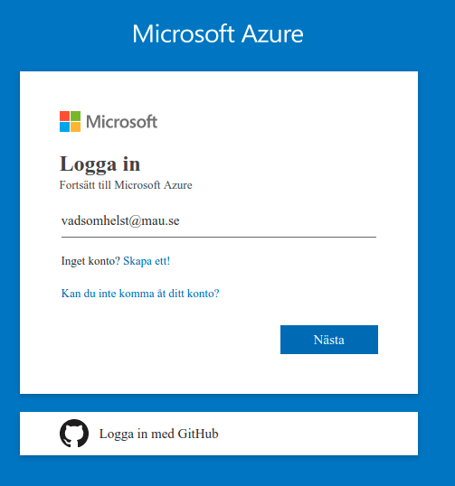

Ange en e-postadress på mau.se-domänen. Eftersom du troligtvis inte har en egen kan du ange vad som helst, exempelvis *vadsomhelst@mau.se*. Det viktiga är att Azure känner igen att du vill använda en inloggning från MAU. Du kan nu ange ditt dator-id och lösenord för att logga in.


### 2.2. Skapa och konfigurera ett containerregister

När du har loggat in möts du av din instrumentpanel.

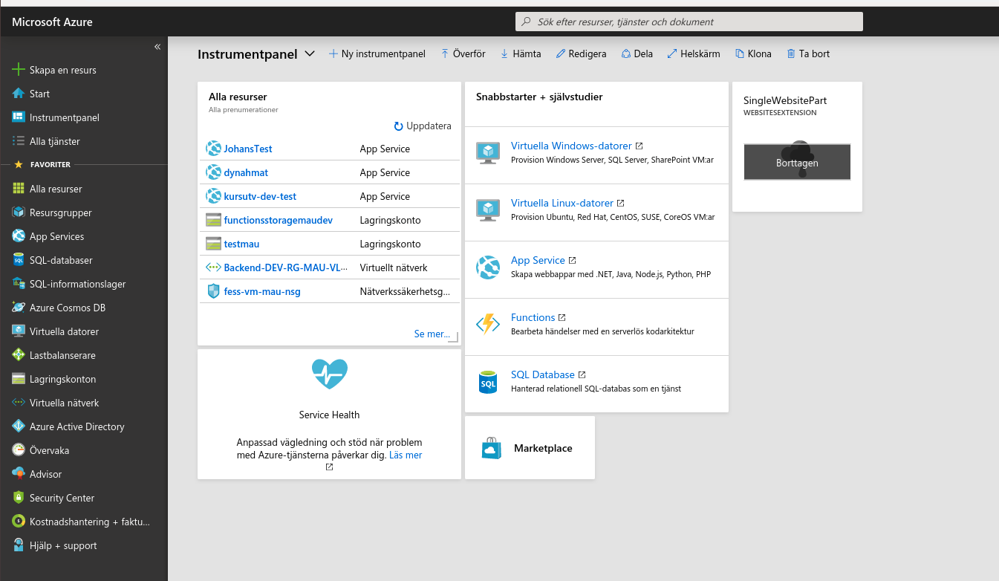

Klicka i sökrutan och skriv *Azure Container Registry*. Klicka på tjänsten och välj sedan *Lägg till*. Ge ditt register ett registernamn, välj din prenumeration och din resursgrupp. Som plats väljer du *Västeuropa* och som SKU väljer du *Basic*, eftersom du inte vill att ditt kära universitet ska elda med dina skattepengar. Välj också att aktivera administratörsanvändare, så att inte vem som helst kan använda ditt containerregister.

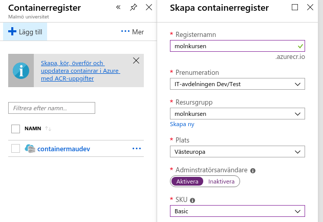

Har du fyllt i allt? Bra, klicka på *Skapa*. När du fått ett meddelande om att allt är okej, kan du ladda om sidan. Gå till sökrutan överst i ditt webbläsarfönster och skriv in det registernamn du valde tidigare. Klicka på träffen under *Resurser* för att öppna.

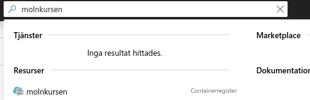

Här hittar du under *Inställningar* valet *Åtkomstnycklar*. Följ den länken för att se ditt registernamn, inloggningsserver, användarnamn och lösenord. Dessa behöver du i nästa steg.

### 2.3. Publicera din Docker-avbildning till Azure

Nu ska du få bygga om din Docker-avbildning igen. Egentligen ska den bara få ett nytt namn innan den kan publiceras. Kom ihåg ditt registernamn från föregående stycke och skriv så här:

```bash
$ docker build -d dittregisternamn.azurecr.io/insultr:latest
```

Nu har du en ny, fin registerbild som vi kan skicka upp. Först måste du dock logga in på *Azure Container Registry*. För det behöver du inloggningsserver, användarnamn och lösenord från ovan. Logga in genom att skriva

```bash
$ docker login dittregisternamn.azurecr.io
Username: dittanvändarnamn
Password: dittlösenord
```

Nu är du inloggad, och kan publicera din Dockeravbildning genom att skriva

```bash
$ docker push dittregisternamn.azurecr.io/insultr:latest
```

## 3. Skapa en App Services-instans

### 3.1. Skapa och konfigurera din App Services-instans

När du har loggat in möts du av din instrumentpanel. Klicka på alternativet *Create a resource*.


Du kommer nu till en vy där du kan välja vilken typ av resurs du vill skapa. Välj resurstypen *Web App for Containers* (se bild).

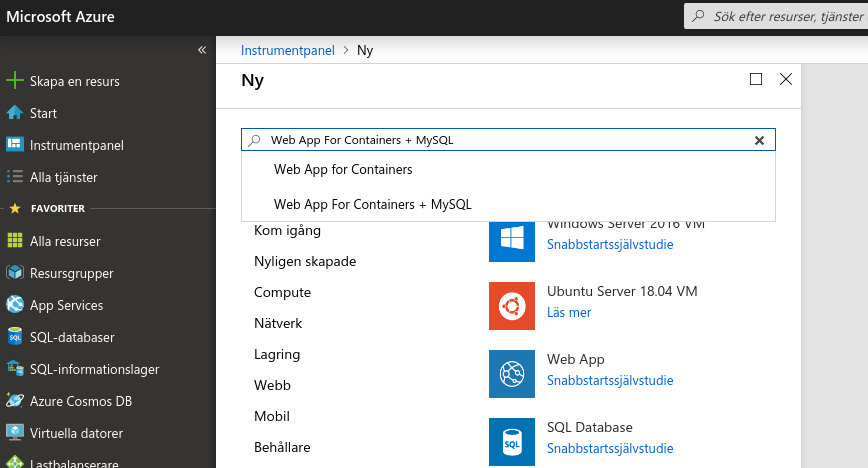

När du gjort det, tas du till arbetsflödet för skapande av webapplikationer. Ditt första steg är att välja ett namn för din applikation. Detta namn måste vara globalt unikt, eftersom applikationen du skapar kommer att vara nåbar på *valt_namn.azurewebsites.net*. Det gör att du konkurrerar med hela världen om bra namn. Ett tips är att välja ett namn i stil med *da288a-minhäftigaapplikation*. Här väljer du även den prenumeration du vill använda. Du bör ha ett enda val här. Johan, som jobbar på IT-avdelningen, har lite fler och väljer därför *Enterprise Dev/Test*. Du har en egen.

I samma vy måste du även skapa en resursgrupp. Azure kommer att föreslå samma namn som du har på din applikation. Godkänn det. Vi kommer inte att titta vidare på resursgrupper i kursen.

Det sista du gör innan du går vidare är att välja vilken typ av miljö du vill använda. Välj *Linux* som operativsystem och avsluta med att klicka på *Konfigurera container*. Under fliken *Enskild container*, klicka på *Azure Container Registry* och skriv in *insultr* i "Avbildning" och *latest* i "Tagg".

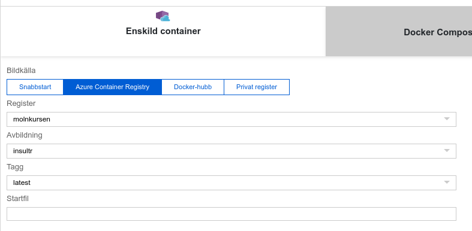

Klicka slutligen på *Skapa* för att köra igång. Låt Azure få jobba en stund tills du får ett meddelande i övre högra hörnet som säger att maskinen är klar att användas. Du kan nu klicka på *Alla resurser* för att hitta din resurs. Min heter som bekant *molnkursen*. Klicka på den. Du får nu se en dashboard-vy över din resurs. Längst upp till höger finns en URL som du kan klicka på:

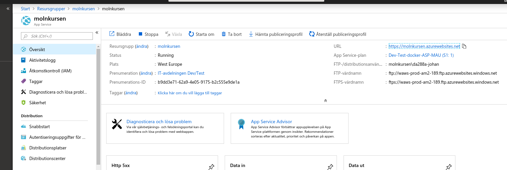

Klicka på URL:en och se vad som händer. Först kommer det att ta ett tag, sedan kommer du att se din nya förolämplningstjänst live i all sin härlighet.

### 3.2. Läs vidare om MySQL på Azure

:warning: Det här tar upp saker som inte ingår i labben, men som kan vara av godo till ditt projekt. Läs igenom texten och kom ihåg att du sett den. Gå sedan vidare till nästa steg.

Om du använder en databas i ditt projekt, kan du behöva dra igång en MySQL-server på Azure. Det här gör du inte på din App Service, utan genom att starta upp en MySQL-resurs. Läs [mer om det här](https://docs.microsoft.com/sv-se/azure/mysql/quickstart-create-mysql-server-database-using-azure-portal). Du kan också behöva ställa om Laravel till att använda den externa database. [Här finns en post](https://laravel.com/docs/5.6/database) som beskriver hur du gör.

## 4. Förbered Azure Pipelines

### 4.1. Skapa ett konto hos Azure Pipelines

Gå in på [Azure Pipelines](https://azure.microsoft.com/sv-se/services/devops/pipelines/) och välj *Starta kostnadsfritt med Pipelines*.

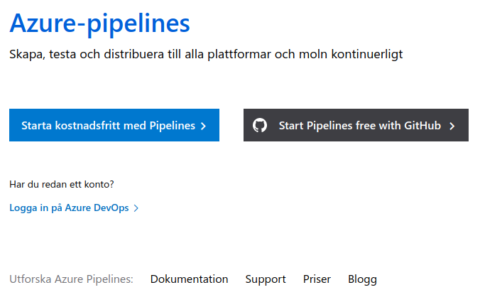

Logga in med din datorinloggning. Vill du använda Azure Pipelines för privata projekt bör du använda andra uppgifter, men i kursen duger dina inloggningsuppgifter utmärkt. I nästa steg väljer du var du vill att din applikation ska driftas. Välj *West Europe*, fyll i capchan och gå vidare.

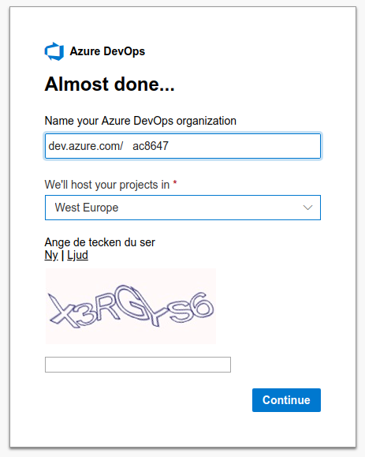

Nu kan du skapa ditt första projekt. Jag döper mitt till *Molnkursen*, eftersom jag har dålig fantasi. Du kan döpa ditt till vad du vill. Välj att göra projektet publikt. När du är klar, klicka på *Create project*.

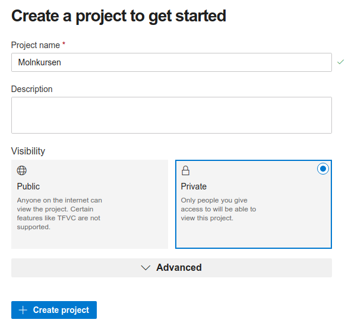

### 4.2. Koppla till GitHub

Nu ska du koppla på ditt konto GitHub-kontot till Azure Pipelines. Genom att göra detta kan vi automatiskt driftsätta nya versioner av applikationer när de uppdateras.


Klicka på *Authorize Azure Pipelines* för att ge åtkomst till dina repositories.

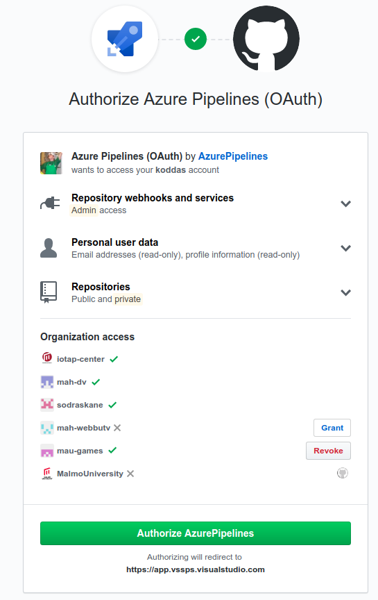

## 5. Starta en pipeline

I det här steget vill vi starta en ny pipeline. Välj ett lämpligt git-reposiory från listan (jag väljer *koddas/insultr*. Du väljer så klart *dittnamn/insultr*.

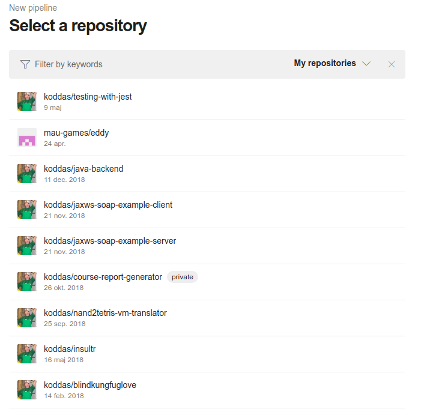


Nu väljer du vilken type av pipeline som du vill arbeta med. Eftersom Azure och GitHub har kommit överens om att du verkar arbeta med PHP, väljer du just *PHP*.

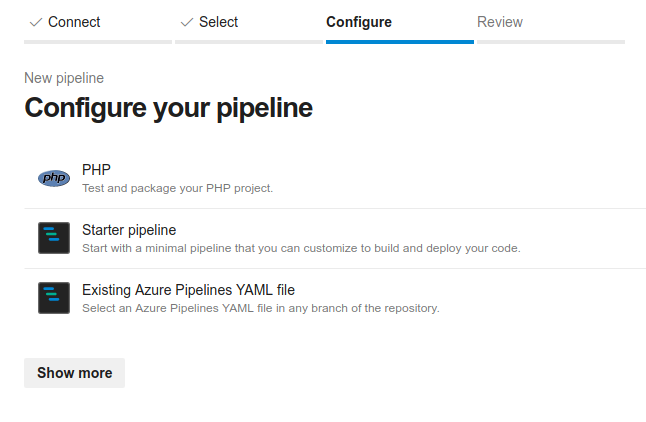

Azure Pipelines styrs av ett gäng direktiv, inte helt olikt hur vi berättar för Docker Composer hur den ska hantera våra Docker-byggen. Det du ser framför dig nu är konfigurationsfilen *azure-pipelines.yml*. Den definierar hur vår maskin ska se ut och hur allt installeras på den. Speciellt intressant är det sista stycket: *script*. Här beskriver vi hur Composer ska installera våra beroenden.

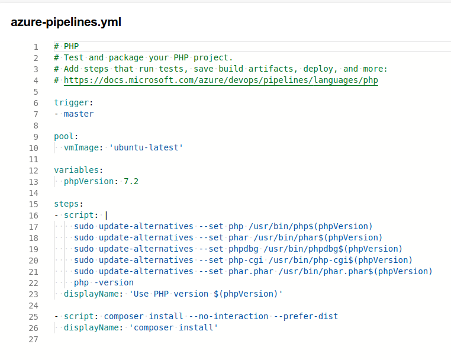

Om vi haft en *azure-pipelines.yml* i vår Git-repository redan nu, hade det första bygget startat nu. Istället kommer Azure Pipelines att vilja lägga en konfigurationsfil i ditt repository på GitHub. Gör det genom att skapa en ny branch, som vi sedan mergar in i *develop*. Jag döper min till *feature/azure-pipelines*. Klicka på *Save and run*.

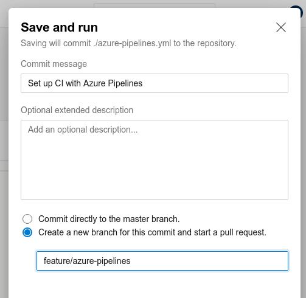

### 5.1. Det första bygget

När du klickat på *Save and run* görs det första testbygget av din applikation. Azure DevOps, som Azure Pipeline är en del av, kommer att hämta hem den senaste versionen av *master*, starta en container som kör PHP 7.2 och sedan köra *composer install* för att installera alla beroenden. Om du gjort allt rätt, kommer du att ha ett komplett bygge som ser ut ungefär så här:

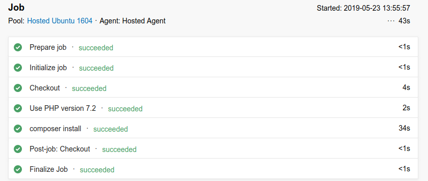

Klicka gärna på de olika raderna för att se en sammanfattning av vad som gjorts.

### 5.2. Sätt miljövariabler

När vi tidigare i kursen pratade git lärde vi oss att vi inte vill spara miljövariabler i själva källkoden (och framförallt inte versionshantera dem), eftersom de lätt hamnar på vift. Lyckligtvis har de goda herrarna och damerna som byggde Azure tänkt på detta och byggt in stöd för detta. Gå till dina Pipelines och klicka på *Library*:

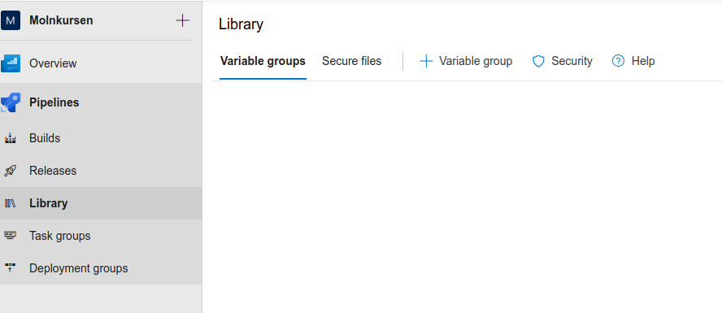

Klicka sedan på *Variable group*. Döp variabelgruppen till något rimligt, som exempelvis *Insultr*. Klicka sedan på *+ Add* och lägg till följande variabler:

* **dockerId** med värdet *dittregisternamn* från avsnittet om att publicera Dockeravbildningar.
* **imageName** med värdet *insultr*
* **dockerPassword** med lösenordet som du använde när du loggade in på *Azure Container Registry* tidigare.

Klicka sedan på *Save*.

## 6. Trigga byggen via git och GitHub

I det här avsnittet sätter vi upp vår integrationsmiljö så att den körs när vi gör en ny release, dvs gör en ny push till din *master*-branch på GitHub.

### 6.1. Hantera din pull request

I steget där Azure Pipelines skapade *azure-pipelines.yml*, skapades en pull request och en ny branch på GitHub. Nu ska vi hantera dem.

Gå in på ditt projekt på GitHub. Du ser nu att du har en ny branch och en ny pull request:

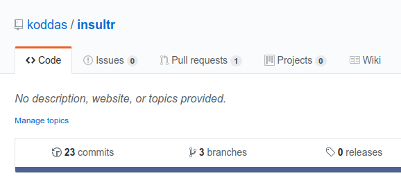

Klicka på pull requesten, som borde heta *Set up CI with Azure Pipelines*. Allt borde vara okej, eftersom vi skapat en ny branch, istället för att använda en existerande:


Klicka på *Merge pull request* och sedan i nästa steg på *Confirm merge*. Så där, nu har du hanterat din första pull request. Detta innebär att du nu har en extra commit i din nya branch *feature/azure-pipelines*. Nu ska vi slå samman den med develop.

Gå till terminalen och skriv *git pull*:

```bash
$ git pull
remote: Enumerating objects: 2, done.
remote: Counting objects: 100% (2/2), done.
remote: Compressing objects: 100% (2/2), done.
remote: Total 2 (delta 1), reused 0 (delta 0), pack-reused 0
Packar upp objekt: 100% (2/2), klart.
Från https://github.com/koddas/insultr
 * [ny gren]         feature/azure-pipelines -> origin/feature/azure-pipelines
   462197e..9793852  master                  -> origin/master
Redan à jour.

```

Du får nu en ny gren även i ditt lokala repository som vi kan slå samman med hjälp av Gitflow:

```bash
$ git flow feature finish azure-pipelines
Redan på "develop"
Din gren är à jour med "origin/develop".
Uppdaterar 462197e..8d31259
Fast-forward
 azure-pipelines.yml | 26 ++++++++++++++++++++++++++
 1 file changed, 26 insertions(+)
 create mode 100644 azure-pipelines.yml
Username for 'https://github.com': koddas
Password for 'https://koddas@github.com': 
To https://github.com/koddas/insultr.git
 - [deleted]         feature/azure-pipelines
Tog bort grenen feature/azure-pipelines (var 8d31259).

Summary of actions:
- The feature branch 'feature/azure-pipelines' was merged into 'develop'
- Feature branch 'feature/azure-pipelines' has been locally deleted; it has been remotely deleted from 'origin'
- You are now on branch 'develop'
```

### 6.2. Skapa en första release

Din *develop* innehåller nu alla förutsättningar för att trigga byggen med Azure Pipelines. Nu ska Azure Pipelines bara förstå det med. Det gör den när den ser att det finns en *azure-pipelines.yml* i din *master*-gren, och det löser vi lätt genom att skapa en release:

```bash
$ git flow release start 1.0
Växlade till en ny gren "release/1.0"

Summary of actions:
- A new branch 'release/1.0' was created, based on 'develop'
- You are now on branch 'release/1.0'

Follow-up actions:
- Bump the version number now!
- Start committing last-minute fixes in preparing your release
- When done, run:

     git flow release finish '1.0

$ git flow release finish 1.0
Växlade till grenen "master"
Din gren är à jour med "origin/master".
Växlade till grenen "develop"
Din gren är à jour med "origin/develop".
Redan à jour!
Merge made by the 'recursive' strategy.
Tog bort grenen release/1.0 (var 9793852).

Summary of actions:
- Release branch 'release/1.0' has been merged into 'master'
- The release was tagged '1.0'
- Release tag '1.0' has been back-merged into 'develop'
- Release branch 'release/1.0' has been locally deleted
- You are now on branch 'develop'
```

### 6.3. Trigga ett bygge

Azure Pipelines kommer att göra nya byggen när den ser att något förändrats i din *master*. För att testa detta, gå till din *develop* och öppna filen *README.md*. Om den inte redan finns, skapa den.

*README.md* är en enkel readme-fil med information om ditt projekt. Här vill vi lägga till en liten badge som visar att ditt projekt minsann går att bygga. Gå till Azure Pipelines och välj ditt projekt. I kontextmenyn (se bild nedan), väljer du *Status badge*. Kopiera texten i *Sample Markdown* och klipp in i din *README.md* på lämpligt ställe.

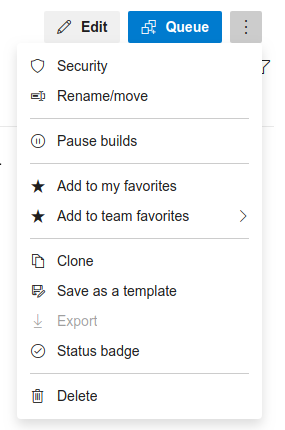

Gör en commit, push och sedan en ny release. Gör en `git checkout master` och sedan `git push`. Ladda om sidan i Azure Pipelines och säkerställ att ett nytt bygge triggats. Som en extra bonus kommer du att få en snygg lite badge på ditt projekts startsida på GitHub när bygget är färdigt. Gå gärna dit och se efter.

### 6.4. Kör dina enhetstester

Vi vill ju helst inte släppa kod som inte fungerar som den ska, så vi vill köra tester i samband med att vi gör en release. Detta gör du naturligtvis även lokalt, men vi vill göra ett sista test innan vi släpper det live. Öppna därför *azure-pipeline.yml* och lägg till följande

```yaml
- script: phpunit
  displayName: 'Run tests with phpunit'
```

Klicka på spara. Azure vill i vanlig ordning spara direkt till *master*. Här kan du välja på att hantera det i master (och sedan skapa en *hotfix* med Git flow eller en *feature* som du hanterar som tidigare). Nästa gång ditt bygge körs kommer du att få se dina tester köras med. Här är det fiffiga: Om testerna inte går igenom, stoppas bygget och kan inte släppas till produktion. Najs, eller hur?

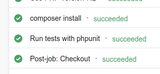

### 6.5 Generera en ny Dockeravbildning

När dina tester gått igenom, vill vi att Azure bygger en ny Dockeravbilndning åt oss. Det gör vi genom att lägga till följande rader i *azure-pipeline.yml*:

```yaml
- script: |
    docker build -t $(dockerId).azurecr.io/$(imageName) .
    docker login -u $(dockerId) -p $(dockerPassword) $(dockerId).azurecr.io
    docker push $(dockerId).azurecr.io/$(imageName):latest
```

När du nu sparar, kommer bygget inte att kunna slutföras, och det beror på att vi inte kopplat på variablerna som vi skapade i avsnitt 4.2. Det gör du genom att klicka på kontextmenyknappen längst upp till höger och välja *Variables*. Välj *Variable groups* och klicka sedan på *Link variable group*. Välj *Insultr* och spara. Trigga ett nytt bygge genom att klicka på knappen *Run*. Nu bör ditt bygge fungera.

### 6.6. Lägg till en koppling till Azure Container Registry

När bygget väl fungerar, är det viktigt att se till att du kan komma åt din nyskapade Dockeravbildning. Gör detta genom att i Azure Pipelines klicka på *Project Settings* och sedan på *Service connections*. Klicka sedan på *New service connection* och välj *Docker Registry*. Välj *Azure Container Registry* under *Registry type*, ange ditt servernamn (*dittregisternamn.azurecr.io*), väljd in prenumeration och ange ditt containerregister (*dittregisternamn*). Klicka sedan på *OK*.


## 7. Koppla på driftsättningen

Det här är vårt sista steg. Vi vill att våra testade byggen automatiskt sätts i produktion. Det fungerar i kort så här:

1. *Azure Pipelines Builds* bygger din applikation och sparar undan den som en Dockeravbildning i *Azure Container Registry*.
2. *Azure Pipelines Builds* notifierar *Azure Pipelines Releases* att ett nytt lyckat bygge finns tillgängligt.
3. *Azure Pipelines Releases* skapar en ny release genom att hämta ut Dockeravbildningen ur *Azure Container Registry* och driftsätta den på den *Azure App Services*-instans som du satte upp i avsnitt 3.
4. *Azure App Services* startar om din applikation och din applikation är live.

### 7.1. Gör en deployment-lina

Klicka på *Pipelines* i menyn:

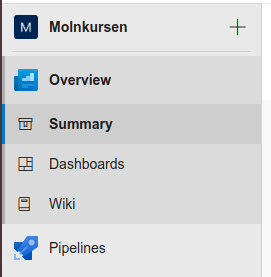

Klicka därefter på *Releases* och sedan på *New pipeline*. En ny release-lina skapas nu, och din första uppgift blir att sätta upp deployment-steget. Det du ser framför dig är två paneler, märkta *Artifacts* och *Stages*. I *Artifacts* kommer du snart att välja Dockeravbildningen som du byggde i avsnitt 5. Först ska du dock ta hand om deploymentsteget, som just nu heter *Stage 1*:


Klicka på *Azure App Service deployment*. Den lilla lådan i mitten av skärmen blir nu lite blåare och har en liten röd symbol bredvid texten *1 job, 1 task*. Det betyder att vi är en bit på väg. Först ska du få döpa om steget till något annat än *Stage 1*. Ett bra namn är exempelvis *Production*, som i vårt fall betyder "produktionsserver".

I en verkligare situation, hade vi satt upp lite fler steg för exempelvis extra validering, driftsättning på en staging-server och en massa annat kul. Vi struntar i det här, utan gör en deployment till produktionsservern direkt.

När du skapat ett nytt namn, klickar du på länken *1 job, 1 task*. Du får nu möjlighet att välja vilken resurs du vill driftsätta din applikation på, samt vad du faktiskt vill driftsätta på den:

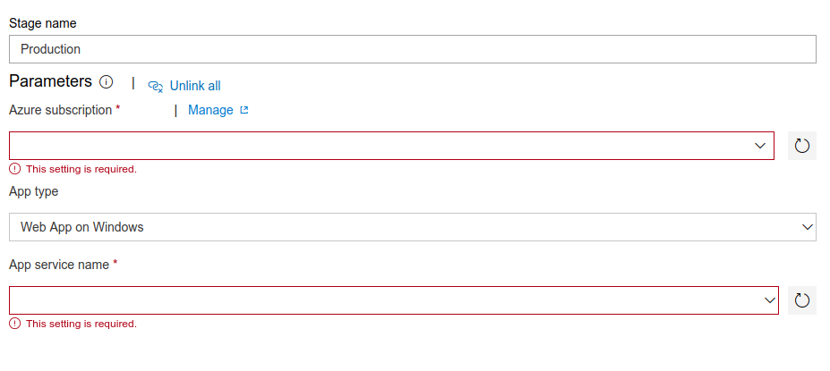

Börja med att välja din prenumeration. Du får nu lite fler val än tidigare, men får å andra sidan hjälp med att välja utifrån dina tidigare inställningar. Gör följande val:

* **Azure subscription**: Din prenumeration. Klicka därefter på *Authorize* och följ miniguiden för att komma åt dina tidigare inställningar.
* **App type**: *Web App for Containers (Linux)*. Väljer du något annat kan du inte driftsätta på den app service du satte upp i avsnitt 3.
* **App service name**: Välj den app service som du skapade i avsnitt 3 (*dittnamn*).
* **Registry or Namespace**: Namnet på ditt containerregister från avsnitt 2.2 (*dittregisternamn.azurecr.io*).
* **Repository**: Här skriver du in namnet på applikationen (*insultr*).

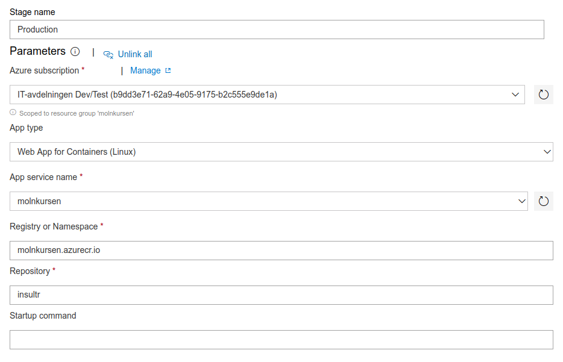

Klicka sedan på *Save* och klicka på *Add an artifact* under panelen *Artifacts*. Här får du välja vilken Dockeravbildning som ska driftsättas. Börja med att välja *Build* under *source type*.

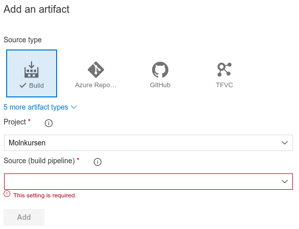

Gör följande val:

* **Artifacts**: 
* **Project**: Välj ditt projekt från avsnitt 6. I mitt fall är det *Molnkursen*.
* Source (build pipeline): Namnet på artefakten som skapades i avsnitt 6. I mitt fall är det **koddas.insultr**.
* **Default version**: *Latest*, eftersom vi vill driftsätta den senaste versionen.
* **Source alias**: Det här kan vara lite vad som, eftersom det bara är ett alias. En bra strategi är att välja det förvalda namnet. I mitt fall: *_koddas.insultr*.

Klicka sedan på *Add*.

## 7.2. Lägg till triggers och villkor

Nu är din driftsättningslina i princip klart. Det du vill göra nu är att se till att automatiseringen fungerar bra. Du gör detta genom att sätta på en driftsättningstrigger på artefakten och villkor på produktionssteget. Vi börjar med driftsättningstriggern genom att klicka på den lilla blixt-ikonen på artefakt-lådan:

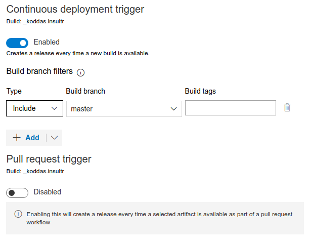

Det första valet du gör är att slå på funktionaliteten genom att klicka på skiftkontrollen. När det står *Enabled* är du klar. Välj typen *Include* och git-grenen *master*. Eftersom vi kör med Gitflow ligger våra releaser på *master*. Man skulle kunna tänka sig att sätta upp en annan driftsättningslina för en testserver, där vi gör en driftsättning när *develop* uppdateras. Klicka sedan på *Save* och gå vidare. Klicka på den lilla ikonen med en blixt och en person på *Production*.

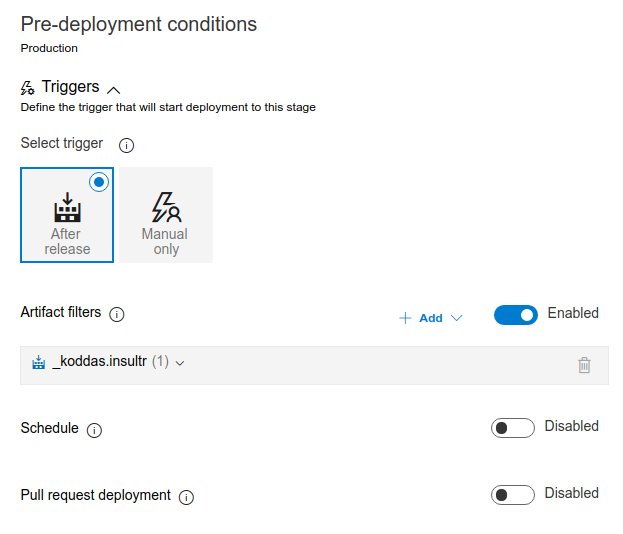

Här sätter du relativt få värden:

* **Trigger**: *After release*, eftersom det ska köras när artefakten gjorts klar för driftsättning.
* **Artifact filter**: Slå till så att den blir *Enabled*, välj sedan artefakten från 7.1, i mitt fall *_koddas.insultr*.

När du är klar, klicka på *Spara*.

### 7.3. Trigga en driftsättning

Klicka nu på *Create release*:


Nu är du igång och kan snart skapa din första riktiga driftsättning. Klicka på knappen *Create* och se på hur Azure börjar jobba:


Klicka på länken *Release-1* (i bilden ovan heter den *Release-17*, men din är ny och fräsch, och heter därför *1*). Håll ögonen öppna på rutan i *Stages*. När den blir grön och visar texten *Succeeded*, klickar du på *Succeeded*, som i själva verket är en länk:

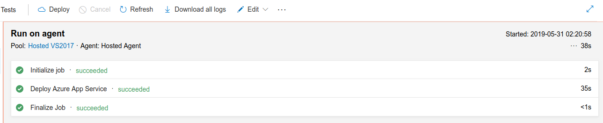

Det du ser är en log över de steg som *Azure Pipelines* gjort för att driftsätta din applikation. Om du klickar på de tre olika *succeeded*-länkarna får du information om de olika stegen. Framförallt det andra steget, *Deploy Azure App Service*, är intressant. Klicka på den och titta på den näst sista raden. Där finns en URL. Klicka på den:

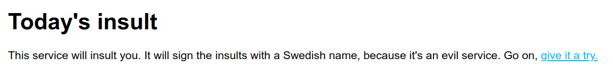

Nu har du dragit igenom en hel driftsättning manuellt, och det fungerar! Nästa steg:

## 8. Kontrollera att allt fungerar

Gör en liten förändring av Insultr-koden. Inget stort, testa att göra en kosmetisk förändring. Gör sedan en commit, skapa en release med Gitflow och pusha upp den till Github. Vänta en minut eller två. Gå tillbaka till webbsidan som skapades i början av laborationen. Ladda om den. Fungerar det? Bra!

Nu har du skapat en php-applikation, satt upp en toolchain för CI/CD i en molntjänst med hjälp av någorlunda moderna utvecklingsmetoder och borde vara nöjd med dig själv. Precis det som kursen skulle ta upp. Wohoo!


Ja, just det. Molntjänster kostar pengar. Vi, skattebetalarna, blir jätteglada om du tar bort dina Azure-resurser när du är klar med laborationen.
